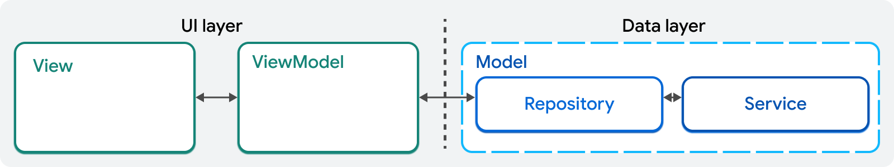
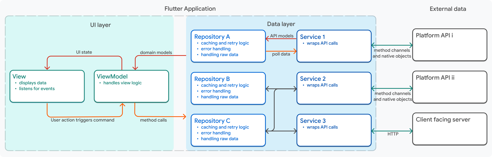

# flutter_app

A new Flutter project.

## Getting Started

This project is a starting point for a Flutter application.

A few resources to get you started if this is your first Flutter project:

- [Lab: Write your first Flutter app](https://docs.flutter.dev/get-started/codelab)
- [Cookbook: Useful Flutter samples](https://docs.flutter.dev/cookbook)

For help getting started with Flutter development, view the
[online documentation](https://docs.flutter.dev/), which offers tutorials,
samples, guidance on mobile development, and a full API reference.

## Flutter filstruktur - MVVM
MVVM is an architectural pattern that separates a feature of an application into three parts: the Model, the ViewModel and the View. Views and view models make up the UI layer of an application. Repositories and services represent the data of an application, or the model layer of MVVM. Each of these components is defined in the next section.





## Projektstruktur (MVVM)

Projektet følger MVVM-arkitekturen og har følgende mappestruktur under `lib/`:

```
lib/
  core/           # Grundlæggende konstanter, temaer og hjælpefunktioner
    constants/    # Applikationskonstanter som farver, strenge, API-endepunkter og andre faste værdier
    theme/        # Applikationens design-tema inklusive farver, typografi, spacing og andre visuelle konstanter
    utils/        # Hjælpefunktioner og utility-klasser der kan bruges på tværs af hele applikationen
  data/           # Data-adgangslag (modeller og services)
    models/       # Data-modeller der repræsenterer datastrukturer og business entities
                  # - API response modeller (JSON til Dart objekter)
                  # - Database modeller (hvis der bruges lokal database)
                  # - Domain modeller (business logic objekter)
    services/     # Services der håndterer data-operationer og ekstern kommunikation
                  # - API services (HTTP requests til backend)
                  # - Database services (CRUD operationer)
                  # - Authentication services
                  # - File handling services
  features/       # Funktionaliteter opdelt efter domæne/feature
    login/
      model/      # Modeller specifikt for login
      view/       # UI-komponenter (Views) for login
      view_model/ # ViewModels for login
      widgets/    # Genanvendelige widgets for login
    weather/
      model/
      view/
      view_model/
      widgets/
  routing/        # Navigationslogik
  shared/         # Delte extensions og widgets på tværs af features
      extensions/   # Dart extensions der udvider eksisterende klasser med ny funktionalitet
      widgets/      # Genanvendelige UI-komponenter der kan bruges på tværs af features
  main.dart       # Applikationens entrypoint
```