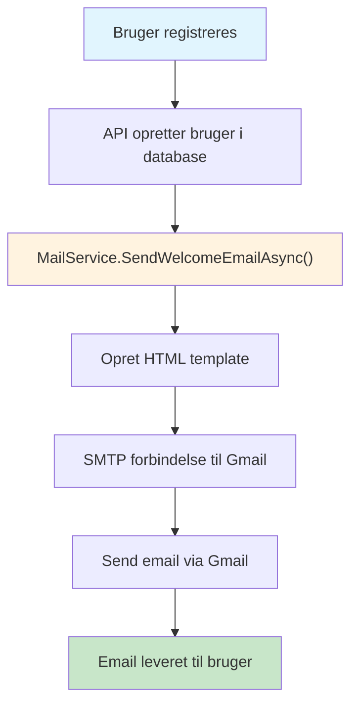
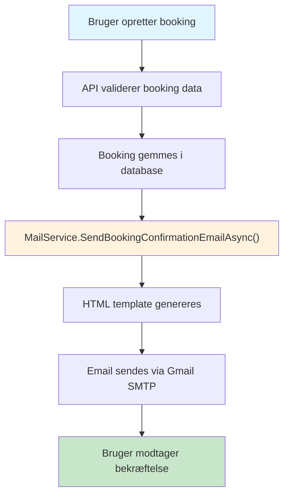

![[Email Alternatives.png]]

# 📧 Mail Service - Backend Email Funktionalitet

## 🎯 Hvad er Backend Email Sending?

Backend email sending betyder at din **server/API** sender emails automatisk uden brugerinteraktion. I stedet for at brugeren skal åbne deres email klient, sender systemet emails direkte via SMTP protokollen.

### 🔄 Frontend vs Backend Email

| **Frontend Email** | **Backend Email** |
|-------------------|------------------|
| Bruger åbner email klient | Server sender automatisk |
| Manuelt process | Automatiseret process |
| Bruger skal skrive email | System genererer email |
| Ingen integration | Fuldt integreret i applikation |

## 🏗️ Hvordan Fungerer Det?

### 1. **SMTP Protokol**
```
[API Server] --SMTP--> [Gmail Server] --Internet--> [Modtager]
```

- **SMTP** = Simple Mail Transfer Protocol
- **Port 587** = Sikker email sending (TLS/SSL)
- **Gmail Server** = smtp.gmail.com

### 2. **Email Flow i H2-MAGS**



## 🔧 Teknisk Implementation

### **MailService.cs - Hovedkomponenten**

```csharp
public class MailService
{
    // SMTP konfiguration fra appsettings.json
    private readonly string _smtpServer = "smtp.gmail.com";
    private readonly int _smtpPort = 587;
    private readonly string _smtpUsername; // Din Gmail
    private readonly string _smtpPassword; // App Password
    
    // Send email via Gmail SMTP
    public async Task<bool> SendEmailAsync(string toEmail, string subject, string body)
    {
        using var smtpClient = new SmtpClient(_smtpServer, _smtpPort)
        {
            EnableSsl = true,        // Gmail kræver SSL
            Credentials = new NetworkCredential(_smtpUsername, _smtpPassword)
        };
        
        await smtpClient.SendMailAsync(mailMessage);
    }
}
```

### **Integration i UsersController**

```csharp
[HttpPost("register")]
public async Task<IActionResult> Register([FromBody] RegisterDto dto)
{
    // 1. Opret bruger i database
    _context.Users.Add(user);
    await _context.SaveChangesAsync();
    
    // 2. Send velkommen email AUTOMATISK
    await _mailService.SendWelcomeEmailAsync(dto.Email, dto.Username, userRole.Name);
    
    return Ok("Bruger oprettet og email sendt!");
}
```

### **Integration i BookingsController**

```csharp
[HttpPost]
public async Task<ActionResult<BookingGetDto>> PostBooking(BookingPostDto dto)
{
    // 1. Opret booking i database
    var booking = BookingMapping.ToBookingFromPostDto(dto, room.PricePerNight);
    _context.Bookings.Add(booking);
    await _context.SaveChangesAsync();
    
    // 2. Send booking bekræftelse email AUTOMATISK
    await _mailService.SendBookingConfirmationEmailAsync(
        user.Email, user.Username, room.Number, 
        hotel.Name, booking.StartDate, booking.EndDate,
        booking.NumberOfGuests, booking.TotalPrice, booking.Id
    );
    
    return CreatedAtAction("GetBooking", new { id = booking.Id }, bookingDto);
}
```

## 📋 Email Typer i H2-MAGS

### 1. **Velkommen Email** 🎉
- **Når**: Ved brugeroprettelse
- **Indhold**: HTML template med brugerinfo
- **Automatisk**: Ja, ingen brugerinteraktion

### 2. **Test Email** 🧪
- **Når**: Admin tester konfiguration
- **Indhold**: Simpel test besked
- **Automatisk**: Ja, via test endpoint

### 3. **Booking Bekræftelse Email** 🏨
- **Når**: Ved booking oprettelse
- **Indhold**: Detaljeret booking information med pris og datoer
- **Automatisk**: Ja, sendes umiddelbart efter booking oprettelse

### 4. **Fremtidige Email Typer** 📅
- Password reset emails
- Booking ændringer og annulleringer
- System notifikationer
- Rapporter og alerts

## 🔒 Sikkerhed og Konfiguration

### **Gmail App Password Setup**

1. **2-Factor Authentication** påkrævet
2. **App Password** i stedet for normal adgangskode
3. **SMTP credentials** gemt sikkert i appsettings.json

```json
{
  "MailSettings": {
    "SmtpServer": "smtp.gmail.com",
    "SmtpPort": "587",
    "SmtpUsername": "din-email@gmail.com",
    "SmtpPassword": "dit-16-cifrede-app-password",
    "FromEmail": "din-email@gmail.com",
    "FromName": "H2-MAGS System"
  }
}
```

## 🎨 HTML Email Templates

### **Professionel Styling**
- **Responsive design** - virker på alle enheder
- **Branding** - H2-MAGS farver og logo
- **Struktur** - Header, content, footer
- **Interaktivt** - Knapper og links

### **Template Eksempler**

#### **Velkommen Email Template**
```html
<!DOCTYPE html>
<html>
<head>
    <style>
        .container { max-width: 600px; margin: 0 auto; }
        .header { background: #007bff; color: white; }
        .button { background: #007bff; padding: 12px 25px; }
    </style>
</head>
<body>
    <div class="container">
        <h1>🎉 Velkommen til H2-MAGS!</h1>
        <p>Hej {username}, din konto er oprettet!</p>
        <a href="https://h2-mags-admin.mercantec.tech" class="button">
            Log ind på systemet
        </a>
    </div>
</body>
</html>
```

#### **Booking Bekræftelse Email Template**
```html
<!DOCTYPE html>
<html>
<head>
    <style>
        .container { max-width: 600px; margin: 0 auto; }
        .header { background: #28a745; color: white; }
        .booking-details { background: #f8f9fa; padding: 20px; }
        .price-highlight { background: #d4edda; text-align: center; }
        .booking-info { display: grid; grid-template-columns: 1fr 1fr; gap: 15px; }
    </style>
</head>
<body>
    <div class="container">
        <h1>🏨 Booking Bekræftelse</h1>
        <div class="booking-details">
            <h3>📋 Booking Detaljer</h3>
            <div class="booking-info">
                <div>Hotel: {hotelName}</div>
                <div>Rum: #{roomNumber}</div>
                <div>Check-in: {startDate}</div>
                <div>Check-out: {endDate}</div>
                <div>Gæster: {numberOfGuests}</div>
                <div>Nætter: {nights}</div>
            </div>
            <div class="price-highlight">
                <div>Total pris: {totalPrice:C}</div>
            </div>
        </div>
    </div>
</body>
</html>
```

## 🚀 Fordele ved Backend Email

### **1. Automatisering**
- Ingen manuel intervention nødvendig
- Konsistent brugeroplevelse
- Skalerbar til mange brugere

### **2. Integration**
- Fuldt integreret i applikationslogik
- Database triggers kan starte emails
- Event-driven arkitektur

### **3. Professionalisme**
- Branded emails med korrekt styling
- Konsistent format og indhold
- Automatisk personalisering

### **4. Sporing og Logging**
- Alle emails logges i systemet
- Fejlhåndtering og retry logik
- Performance monitoring

## 🔧 Testing og Debugging

### **Test Endpoint**
```
POST /api/users/test-email?testEmail=test@example.com
```

### **Logging Levels**
```json
{
  "Logging": {
    "LogLevel": {
      "API.Services.MailService": "Debug"
    }
  }
}
```

### **Fejlhåndtering**
- SMTP forbindelse fejl
- Ugyldige email adresser
- Gmail rate limiting
- Network timeout

## 📊 Performance og Skalerbarhed

### **Asynkron Processing**
```csharp
// Ikke-blocking email sending
await _mailService.SendWelcomeEmailAsync(email, username, role);
// Brugeroprettelse fortsætter uanset email status
```

### **Error Resilience**
- Email fejl stopper ikke brugeroprettelse
- Retry logik for midlertidige fejl
- Fallback strategier

### **Rate Limiting**
- Gmail har begrænsninger (500 emails/dag for gratis)
- Batch processing for store mængder
- Queue system for høj volumen

## 🎓 Læringsmål for Elever

### **Tekniske Koncepter**
1. **SMTP protokol** - hvordan emails sendes
2. **Dependency Injection** - service integration
3. **Async/await** - ikke-blocking operations
4. **Error handling** - robuste applikationer
5. **Configuration management** - sikker credential håndtering

### **Best Practices**
1. **Separation of Concerns** - MailService er isoleret
2. **Single Responsibility** - hver klasse har ét ansvar
3. **Configuration over Code** - settings i appsettings.json
4. **Logging og Monitoring** - sporing af email aktivitet
5. **Security** - App Passwords, ikke normale passwords

## 🔮 Fremtidige Muligheder

### **Avancerede Features**
- **Email Templates** - Razor templates for dynamisk indhold
- **Email Scheduling** - send emails på bestemt tid
- **Email Analytics** - track åbninger og klik
- **Multi-provider** - support for flere email providers
- **Email Queuing** - background job processing

### **Integration Muligheder**
- **SignalR** - real-time email status updates
- **Background Services** - scheduled email sending
- **Event Sourcing** - email events som del af system state
- **Microservices** - dedikeret email service

---

## 🎯 Praktiske Eksempler

### **Booking Email Flow**



### **Email Data Flow**

| **Input Data** | **Email Output** |
|---------------|------------------|
| Username | Personaliseret hilsen |
| Room Number | Rum information |
| Hotel Name | Hotel detaljer |
| Start/End Date | Check-in/out datoer |
| Number of Guests | Gæste information |
| Total Price | Pris oversigt |
| Booking ID | Reference nummer |

## 🔧 Test og Debugging

### **Test Booking Email**
```bash
# Opret en test booking
POST /api/bookings
{
  "userId": "user-id",
  "roomId": "room-id", 
  "startDate": "2025-02-01",
  "endDate": "2025-02-03",
  "numberOfGuests": 2
}

# Email sendes automatisk til brugeren
```

### **Email Logging**
```csharp
_logger.LogInformation("📧 Sender booking bekræftelse email til: {Email}", userEmail);
_logger.LogInformation("✅ Booking bekræftelse email sendt succesfuldt til: {Email}", userEmail);
_logger.LogWarning("⚠️ Kunne ikke sende booking bekræftelse email til: {Email}", userEmail);
```

## 📊 Performance Overvejelser

### **Asynkron Email Sending**
- Booking oprettelse fortsætter selvom email fejler
- Ingen blocking på brugeroplevelsen
- Fejlhåndtering der ikke påvirker hovedfunktionalitet

### **Email Template Caching**
- HTML templates genereres dynamisk
- Ingen database calls for template data
- Hurtig email generation

## 🎓 Læringsmål for Elever
### **Best Practices Lært**
1. **Separation of Concerns** - MailService isoleret fra booking logik
2. **Fail-Safe Design** - Email fejl stopper ikke booking
3. **Rich Templates** - Professionelle HTML emails
4. **Comprehensive Logging** - Sporing af email status
5. **User-Centric Design** - Værdifuld information i emails

## 📚 Relaterede Emner

- [[SMTP Protocol]]
- [[Gmail API Integration]]
- [[Email Security Best Practices]]
- [[HTML Email Design]]
- [[Async Programming in C#]]
- [[Event-Driven Architecture]]
- [[Template Engines]]

---