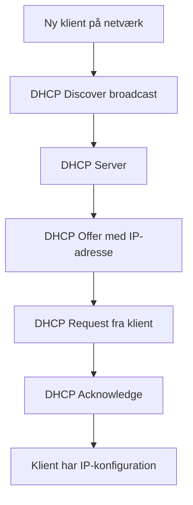
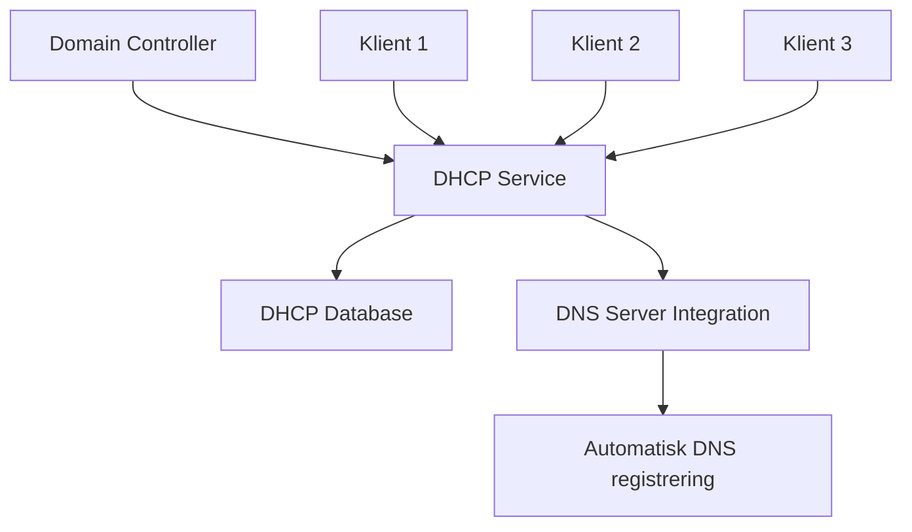

# DHCP og Active Directory Integration

> [!info] Formål
> DHCP (Dynamic Host Configuration Protocol) automatiserer IP-adresse tildeling og er essentiel for smidig klient-integration med Active Directory. Denne guide forklarer DHCP's rolle og integration med AD.

## 🌐 Hvad er DHCP?

**Dynamic Host Configuration Protocol (DHCP)** automatiserer tildeling af IP-konfiguration til netværksklienter, så de kan kommunikere på netværket uden manuel konfiguration.



### DHCP Lease Process (DORA)

| Trin | Beskrivelse | Pakke type |
|------|-------------|------------|
| **Discover** | Klient søger efter DHCP server | Broadcast |
| **Offer** | Server tilbyder IP-adresse | Unicast |
| **Request** | Klient accepterer tilbuddet | Broadcast |
| **Acknowledge** | Server bekræfter lease | Unicast |

---

## 🔗 Hvorfor er DHCP vigtig for Active Directory?

> [!tip] Automatisering og integration
> DHCP forenkler klient-deployment og sikrer konsistent netværkskonfiguration for AD-integration.

### DHCP's rolle i AD-miljøer

#### 1. **Automatisk IP-konfiguration**
- Eliminerer manuel IP-konfiguration på klienter
- Sikrer korrekt DNS server-tildeling (kritisk for AD)
- Automatisk gateway og subnet mask tildeling

#### 2. **DNS Integration**
- DHCP kan automatisk registrere klienter i DNS
- Dynamic DNS updates for A og PTR records
- Sikrer at AD kan finde klienter via DNS

#### 3. **Centraliseret administration**
- Konsistent netværkskonfiguration på tværs af organisationen
- Nem ændring af DNS servere, gateways, etc.
- Reservationer for servere og kritiske enheder

---

## 🏗️ DHCP Arkitektur med Active Directory

### DHCP Server Placement



#### **DHCP på Domain Controller (Almindeligt)**
**Fordele:**
- ✅ Centraliseret administration
- ✅ Automatisk DNS integration
- ✅ Færre servere at administrere

**Ulemper:**
- ❌ Ekstra load på DC
- ❌ Single point of failure

#### **Dedikeret DHCP Server**
**Fordele:**
- ✅ Bedre performance på DC
- ✅ Specialiseret server rolle
- ✅ Lettere at skalere

**Ulemper:**
- ❌ Ekstra server at administrere
- ❌ Kræver DHCP authorization i AD

---

## ⚙️ Installation og Konfiguration af DHCP

### 1. Installation af DHCP Role

```powershell
# Installer DHCP Server rolle
Install-WindowsFeature -Name DHCP -IncludeManagementTools

# Eller via Server Manager
Add-WindowsFeature DHCP
```

### 2. DHCP Authorization i Active Directory

> [!warning] Kritisk trin
> DHCP servere skal autoriseres i AD for at fungere i domænemiljøer

```powershell
# Autoriser DHCP server i AD (kør som Domain Admin)
Add-DhcpServerInDC -DnsName "dc01.demo.local" -IPAddress "192.168.1.10"

# Tjek autoriserede servere
Get-DhcpServerInDC
```

### 3. Opret DHCP Scope

```powershell
# Opret scope for 192.168.1.0/24 netværk
Add-DhcpServerv4Scope -Name "Demo LAN" -StartRange "192.168.1.100" -EndRange "192.168.1.200" -SubnetMask "255.255.255.0"

# Konfigurer scope options
Set-DhcpServerv4OptionValue -ScopeId "192.168.1.0" -OptionId 3 -Value "192.168.1.1"    # Gateway
Set-DhcpServerv4OptionValue -ScopeId "192.168.1.0" -OptionId 6 -Value "192.168.1.10"   # DNS Server
Set-DhcpServerv4OptionValue -ScopeId "192.168.1.0" -OptionId 15 -Value "demo.local"     # DNS Domain
```

**Manuel konfiguration:**
1. Åbn **DHCP Manager** (dhcpmgmt.msc)
2. Højreklik på server → **New Scope**
3. **Scope Name:** Demo LAN
4. **IP Address Range:** 192.168.1.100 - 192.168.1.200
5. **Subnet Mask:** 255.255.255.0
6. **Exclusions:** Reservér IP'er til servere
7. **Lease Duration:** 8 dage (standard)

### 4. Konfigurer DNS Integration

```powershell
# Aktiver DNS dynamic updates
Set-DhcpServerv4DnsSetting -ComputerName "dc01.demo.local" -DynamicUpdates "Always" -DeleteDnsRROnLeaseExpiry $True

# Konfigurer DNS credentials (hvis DHCP ikke er på DC)
Set-DhcpServerDnsCredential -ComputerName "dc01.demo.local" -UserName "demo\dhcp-dns" -Password (ConvertTo-SecureString "Password123!" -AsPlainText -Force)
```

---

## 🔍 Vigtige DHCP Options for Active Directory

### Standard DHCP Options

| Option | Beskrivelse | Værdi eksempel | AD Relevans |
|--------|-------------|----------------|-------------|
| **3** | Default Gateway | 192.168.1.1 | Netværksadgang |
| **6** | DNS Servers | 192.168.1.10 | **Kritisk for AD** |
| **15** | DNS Domain Name | demo.local | **Kritisk for AD** |
| **44** | WINS Servers | 192.168.1.10 | Legacy support |
| **46** | WINS Node Type | 0x8 (H-node) | Legacy support |

### Avancerede Options

```powershell
# NTP Server (Option 42)
Set-DhcpServerv4OptionValue -OptionId 42 -Value "192.168.1.10"

# Domain Search List (Option 119)
Set-DhcpServerv4OptionValue -OptionId 119 -Value "demo.local","corp.demo.local"

# Classless Static Routes (Option 121)
Set-DhcpServerv4OptionValue -OptionId 121 -Value @(24,192,168,2,192,168,1,1)
```

---

## 🎯 DHCP Reservations og Policies

### DHCP Reservations

```powershell
# Opret reservation for server
Add-DhcpServerv4Reservation -ScopeId "192.168.1.0" -IPAddress "192.168.1.50" -ClientId "00-15-5D-00-00-01" -Name "FileServer01" -Description "File Server"

# Opret reservation for printer
Add-DhcpServerv4Reservation -ScopeId "192.168.1.0" -IPAddress "192.168.1.51" -ClientId "00-15-5D-00-00-02" -Name "Printer01" -Description "Network Printer"
```

### DHCP Policies (Windows Server 2012+)

```powershell
# Policy for laptops (kortere lease tid)
Add-DhcpServerv4Policy -Name "Laptops" -ScopeId "192.168.1.0" -Condition OR -MacAddress "EQ,Dell*,HP*,Lenovo*"
Set-DhcpServerv4OptionValue -PolicyName "Laptops" -ScopeId "192.168.1.0" -OptionId 51 -Value 14400  # 4 timer

# Policy for servere (længere lease tid)
Add-DhcpServerv4Policy -Name "Servers" -ScopeId "192.168.1.0" -Condition OR -MacAddress "EQ,VMware*"
Set-DhcpServerv4OptionValue -PolicyName "Servers" -ScopeId "192.168.1.0" -OptionId 51 -Value 2592000  # 30 dage
```

---

## 🧪 Test og Troubleshooting

### DHCP Health Check

```powershell
# Tjek DHCP server status
Get-DhcpServerv4Statistics

# Tjek scope utilization
Get-DhcpServerv4ScopeStatistics

# Tjek lease database
Get-DhcpServerv4Lease -ScopeId "192.168.1.0"

# Test DHCP fra klient
ipconfig /release
ipconfig /renew
```

### Almindelige DHCP-problemer

> [!warning] Typiske fejl
> 
> **Problem:** Klienter får ikke IP-adresse
> **Løsning:** Tjek DHCP authorization: `Get-DhcpServerInDC`
> 
> **Problem:** Klienter kan ikke finde domænet
> **Løsning:** Verificer DNS server option (6) peger på DC
> 
> **Problem:** "No more addresses available"
> **Løsning:** Udvid scope range eller reducer lease tid

### DHCP Monitoring

```powershell
# Overvåg DHCP events
Get-WinEvent -LogName "Microsoft-Windows-DHCP-Server/Operational" | Where-Object {$_.Id -eq 1002}

# Tjek DHCP database integritet
netsh dhcp server dump > dhcp-config-backup.txt

# Reconcile scope (reparér database)
Repair-DhcpServerv4IPRecord -ScopeId "192.168.1.0"
```

---

## 🔧 Best Practices

### DHCP Server Konfiguration

- [ ] **Autoriser DHCP servere** i Active Directory
- [ ] **Konfigurer redundans** med DHCP failover eller split-scope
- [ ] **Aktiver DNS dynamic updates** for automatisk registrering
- [ ] **Backup DHCP database** regelmæssigt
- [ ] **Overvåg scope utilization** (hold under 80%)

### Scope Design

- [ ] **80/20 regel:** Primær server får 80% af adresser
- [ ] **Passende lease tid:** 8 dage for stationære, 4 timer for mobile
- [ ] **Reservér IP-ranges:** Til servere, printere, netværksudstyr
- [ ] **Dokumenter reservations** og deres formål

### Sikkerhed

```powershell
# Aktiver DHCP audit logging
Set-DhcpServerAuditLog -Enable $True -Path "C:\Windows\System32\dhcp"

# Konfigurer DHCP filters (MAC address filtering)
Add-DhcpServerv4Filter -List Allow -MacAddress "00-15-5D-00-00-01" -Description "Approved device"

# Begræns DHCP admin rettigheder
Add-DhcpServerSecurityGroup -ComputerName "dc01.demo.local" -GroupName "DHCP Administrators"
```

---

## 📚 Relaterede emner

- [[DNS og Active Directory]]
- [[Roller og adgang]]
- [[Network Infrastructure]]
- [[Windows Server Roles]]
- [[IP Address Management]]

## 📊 DHCP Performance Metrics

| Metric | Anbefalet værdi | Kommando |
|--------|-----------------|----------|
| **Scope Utilization** | < 80% | `Get-DhcpServerv4ScopeStatistics` |
| **Lease Duration** | 8 dage (LAN) | Scope properties |
| **Response Time** | < 100ms | Performance Monitor |
| **Database Size** | < 100MB | File system check |

---

## 🚨 Disaster Recovery

### DHCP Backup

```powershell
# Backup DHCP konfiguration
Backup-DhcpServer -ComputerName "dc01.demo.local" -Path "C:\DHCPBackup"

# Export DHCP konfiguration
Export-DhcpServer -ComputerName "dc01.demo.local" -File "C:\DHCPExport.xml" -Leases

# Restore DHCP fra backup
Restore-DhcpServer -ComputerName "dc01.demo.local" -Path "C:\DHCPBackup"
```

### DHCP Failover (Windows Server 2012+)

```powershell
# Konfigurer DHCP failover mellem to servere
Add-DhcpServerv4Failover -ComputerName "dc01.demo.local" -PartnerServer "dc02.demo.local" -Name "Demo-Failover" -ScopeId "192.168.1.0" -LoadBalancePercent 50
```

### Emergency DHCP

> [!danger] Nødsituation
> Hvis DHCP fejler komplet, kan du midlertidigt:
> 1. Konfigurer statiske IP'er på kritiske systemer
> 2. Brug `netsh dhcp server export` til hurtig genoprettelse
> 3. Overvej at aktivere APIPA (169.254.x.x) som fallback

---

*Sidst opdateret: {{date}}*
*Tags: #DHCP #ActiveDirectory #Infrastructure #Networking #IPAddressing*