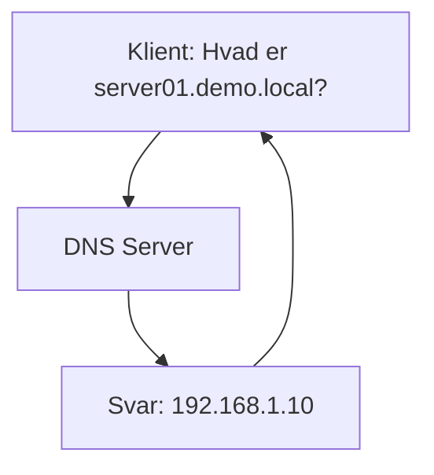
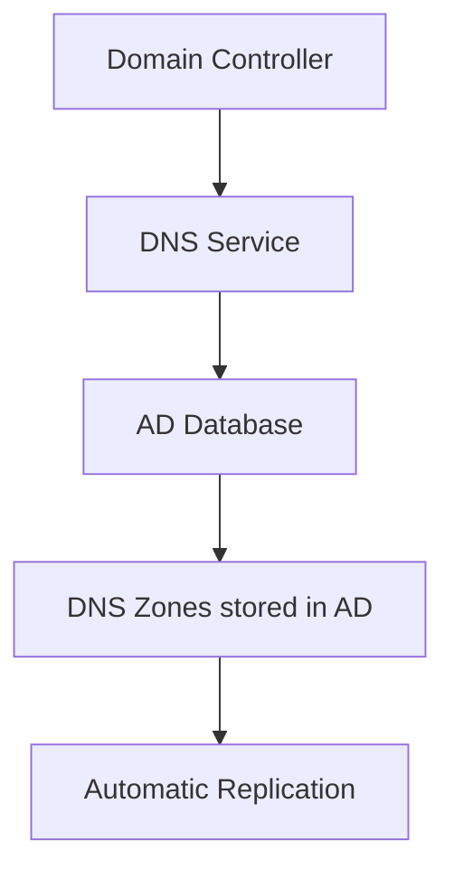
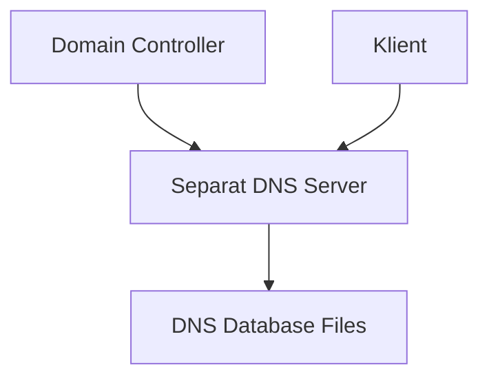

# DNS og Active Directory Integration

> [!info] Formål
> DNS (Domain Name System) er rygraden i Active Directory og kritisk for alle AD-funktioner. Denne guide forklarer hvorfor DNS er så vigtig og hvordan den integreres med AD.

## 🌐 Hvad er DNS?

**Domain Name System (DNS)** er internettet og netværkets "telefonbog" - det oversætter menneskevenlige domænenavne til IP-adresser.



### Grundlæggende DNS-koncepter

| Begreb | Beskrivelse | Eksempel |
|--------|-------------|----------|
| **FQDN** | Fully Qualified Domain Name | server01.demo.local |
| **A Record** | Mapper navn til IPv4-adresse | server01 → 192.168.1.10 |
| **AAAA Record** | Mapper navn til IPv6-adresse | server01 → 2001:db8::1 |
| **PTR Record** | Reverse lookup (IP til navn) | 192.168.1.10 → server01 |
| **SRV Record** | Service location records | _ldap._tcp.demo.local |

---

## 🔗 Hvorfor er DNS kritisk for Active Directory?

> [!warning] Kritisk afhængighed
> **Active Directory kan ikke fungere uden DNS!** AD er 100% afhængig af DNS for at lokalisere domænecontrollere og services.

### AD's DNS-afhængigheder

#### 1. **Domain Controller Location**
```dns
; SRV Records for AD Services
_ldap._tcp.demo.local.        IN SRV 0 100 389 dc01.demo.local.
_kerberos._tcp.demo.local.    IN SRV 0 100 88  dc01.demo.local.
_gc._tcp.demo.local.          IN SRV 0 100 3268 dc01.demo.local.
```

#### 2. **Klient Authentication**
- Klienter bruger DNS til at finde nærmeste Domain Controller
- Kerberos authentication kræver korrekte SRV records
- LDAP queries dirigeres via DNS

#### 3. **Replication**
- Domain Controllers finder hinanden via DNS
- Site-baseret replication styres af DNS SRV records

---

## 🏗️ DNS Arkitektur med Active Directory

### Integreret DNS vs. Separat DNS

#### **AD-Integrated DNS (Anbefalet)**


**Fordele:**
- ✅ Automatisk replication mellem DC'er
- ✅ Secure Dynamic Updates
- ✅ Centraliseret administration
- ✅ Backup inkluderer DNS data

#### **Separat DNS Server**


**Ulemper:**
- ❌ Manuel konfiguration af SRV records
- ❌ Ingen automatisk opdatering
- ❌ Ekstra administrationskompleksitet

---

## ⚙️ Konfiguration af DNS til Active Directory

### 1. Installation af DNS Role

```powershell
# Installer DNS Server rolle
Install-WindowsFeature -Name DNS -IncludeManagementTools

# Eller via Server Manager GUI
Add-WindowsFeature DNS
```

### 2. Opret Forward Lookup Zone

```powershell
# Opret AD-integreret zone
Add-DnsServerPrimaryZone -Name "demo.local" -ReplicationScope "Domain" -DynamicUpdate "Secure"
```

**Manuel oprettelse:**
1. Åbn **DNS Manager** (dnsmgmt.msc)
2. Højreklik **Forward Lookup Zones** → **New Zone**
3. Vælg **Primary zone**
4. ✅ **Store the zone in Active Directory**
5. Vælg replication scope: **To all DNS servers in this domain**

### 3. Opret Reverse Lookup Zone

```powershell
# Opret reverse zone for 192.168.1.0/24 netværk
Add-DnsServerPrimaryZone -NetworkID "192.168.1.0/24" -ReplicationScope "Domain" -DynamicUpdate "Secure"
```

### 4. Konfigurer DNS Forwarders

```powershell
# Tilføj eksterne DNS servere som forwarders
Add-DnsServerForwarder -IPAddress "8.8.8.8","8.8.4.4"
```

---

## 🔍 Vigtige DNS Records for Active Directory

### Automatisk oprettede SRV Records

Når du promoverer en server til Domain Controller, oprettes disse records automatisk:

```dns
; LDAP Services
_ldap._tcp.demo.local.                IN SRV 0 100 389 dc01.demo.local.
_ldap._tcp.dc._msdcs.demo.local.      IN SRV 0 100 389 dc01.demo.local.

; Kerberos
_kerberos._tcp.demo.local.            IN SRV 0 100 88 dc01.demo.local.
_kpasswd._tcp.demo.local.             IN SRV 0 100 464 dc01.demo.local.

; Global Catalog
_gc._tcp.demo.local.                  IN SRV 0 100 3268 dc01.demo.local.
_ldap._tcp.gc._msdcs.demo.local.      IN SRV 0 100 3268 dc01.demo.local.
```

### Verifikation af DNS Records

```powershell
# Tjek om alle nødvendige SRV records eksisterer
dcdiag /test:dns /v

# Test specifik SRV record
nslookup -type=SRV _ldap._tcp.demo.local

# Test reverse lookup
nslookup 192.168.1.10
```

---

## 🧪 Test og Troubleshooting

### DNS Health Check

```powershell
# Komplet DNS test for Domain Controller
dcdiag /test:dns /e /v

# Test DNS fra klient
nslookup demo.local
ping dc01.demo.local

# Tjek DNS konfiguration
ipconfig /all
```

### Almindelige DNS-problemer

> [!warning] Typiske fejl
> 
> **Problem:** Klienter kan ikke logge på domænet
> **Løsning:** Tjek at klient bruger DC som DNS server
> 
> **Problem:** "The specified domain does not exist"
> **Løsning:** Verificer SRV records med `nslookup -type=SRV _ldap._tcp.domæne.local`
> 
> **Problem:** Langsom logon
> **Løsning:** Tjek DNS response times og forwarders

### DNS Monitoring

```powershell
# Overvåg DNS queries
Get-WinEvent -LogName "DNS Server" | Where-Object {$_.Id -eq 2}

# Tjek DNS cache
ipconfig /displaydns

# Ryd DNS cache
ipconfig /flushdns
```

---

## 🔧 Best Practices

### DNS Server Konfiguration

- [ ] **Brug AD-integreret DNS** for automatisk replication
- [ ] **Konfigurer forwarders** til eksterne DNS opslag
- [ ] **Aktiver scavenging** for at rydde gamle records
- [ ] **Implementer redundans** med flere DNS servere

### Klient Konfiguration

- [ ] **Primær DNS:** Domain Controller IP
- [ ] **Sekundær DNS:** Anden DC eller ekstern DNS
- [ ] **DNS suffix:** Samme som AD domæne
- [ ] **Registrer i DNS:** Aktiveret for dynamiske opdateringer

### Sikkerhed

```powershell
# Begræns DNS opdateringer til kun sikre opdateringer
Set-DnsServerPrimaryZone -Name "demo.local" -DynamicUpdate "Secure"

# Konfigurer DNS policies for adgangskontrol
Add-DnsServerQueryResolutionPolicy -Name "BlockMalware" -Action DENY -FQDN "EQ,*.malware.com"
```

---

## 📚 Relaterede emner

- [[Active Directory Installation]]
- [[Roller og adgang]]
- [[Domain Controller Deployment]]
- [[Network Infrastructure]]
- [[Kerberos Authentication]]

## 📊 DNS Performance Metrics

| Metric | Anbefalet værdi | Kommando |
|--------|-----------------|----------|
| **Query Response Time** | < 100ms | `nslookup -debug` |
| **Cache Hit Ratio** | > 80% | Performance Monitor |
| **Failed Queries** | < 1% | DNS Event Log |

---

## 🚨 Disaster Recovery

### DNS Backup
```powershell
# Backup DNS konfiguration
Export-DnsServerZone -Name "demo.local" -FileName "demo.local.dns"

# Restore DNS zone
Import-DnsServerZone -Name "demo.local" -FileName "demo.local.dns"
```

### Emergency DNS
> [!danger] Nødsituation
> Hvis DNS fejler komplet, kan du midlertidigt bruge hosts-filen:
> `C:\Windows\System32\drivers\etc\hosts`
> ```
> 192.168.1.10    dc01.demo.local
> 192.168.1.10    demo.local
> ```

---

*Sidst opdateret: {{date}}*
*Tags: #DNS #ActiveDirectory #Infrastructure #Networking #DomainController*