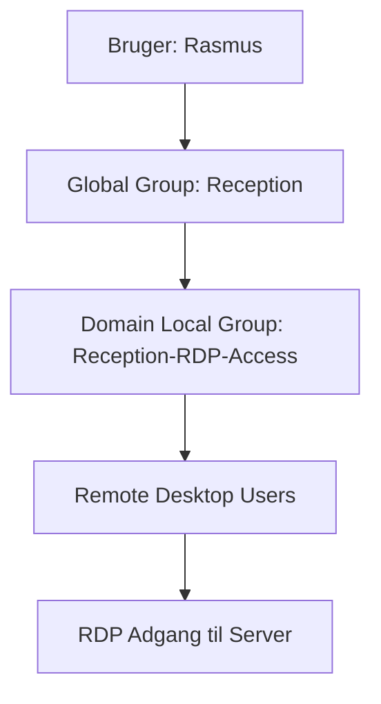

# Active Directory – Roller, Grupper og RDP-adgang

> [!info] Formål
> Denne guide viser, hvordan man kan styre **adgang via grupper** i Active Directory ved hjælp af AGDLP-modellen. Eksemplet følger en receptionist (Rasmus), som skal have adgang til Remote Desktop.

## 📋 Oversigt



## 🎯 AGDLP-modellen
**A**ccounts → **G**lobal → **D**omain Local → **P**ermissions

| Niveau | Beskrivelse | Eksempel |
|--------|-------------|----------|
| **Accounts** | Individuelle brugere | Rasmus |
| **Global** | Funktionsgrupper | Reception |
| **Domain Local** | Ressourcegrupper | Reception-RDP-Access |
| **Permissions** | Faktiske rettigheder | Remote Desktop Users |

---

## 🚀 Implementering

### 1. Opret testbruger

> [!tip] ADUC
> Åbn **Active Directory Users and Computers** (dsa.msc)

**Brugeroplysninger:**
- **First name:** `Rasmus`
- **Last name:** `Receptionist`
- **User logon name:** `Rasmus`
- **Password:** Sæt et sikkert password
- [ ] Fjern "User must change password at next logon"

### 2. Opret Global Group

```powershell
# PowerShell alternativ
New-ADGroup -Name "Reception" -GroupScope Global -GroupCategory Security
Add-ADGroupMember -Identity "Reception" -Members "Rasmus"
```

**Manuel oprettelse:**
1. ADUC → Højreklik på OU → **New → Group**
2. **Group name:** `Reception`
3. **Group scope:** Global
4. **Group type:** Security
5. Tilføj Rasmus som medlem

### 3. Opret Domain Local Group

> [!important] Ressourceadgang
> Domain Local Groups bruges til at tildele adgang til specifikke ressourcer

```powershell
# PowerShell alternativ
New-ADGroup -Name "Reception-RDP-Access" -GroupScope DomainLocal -GroupCategory Security
Add-ADGroupMember -Identity "Reception-RDP-Access" -Members "Reception"
```

**Manuel oprettelse:**
1. ADUC → Højreklik → **New → Group**
2. **Group name:** `Reception-RDP-Access`
3. **Group scope:** Domain Local
4. **Group type:** Security
5. Tilføj `Reception` som medlem

### 4. Tildel RDP-rettigheder

#### Via Built-in gruppe
1. Naviger til **Builtin** OU i ADUC
2. Find **Remote Desktop Users**
3. Dobbeltklik → **Members** tab
4. **Add** → `Reception-RDP-Access`

#### Via Local Security Policy
1. På serveren: Åbn `secpol.msc`
2. Naviger til: **Security Settings** → **Local Policies** → **User Rights Assignment**
3. Find **"Allow log on through Remote Desktop Services"**
4. Tilføj `Reception-RDP-Access`

---

## 🧪 Test og verifikation

### RDP-forbindelse
```bash
# Fra kommandolinje
mstsc /v:server-ip /u:demo\Rasmus
```

**Eller via GUI:**
1. Åbn **Remote Desktop Connection**
2. **Computer:** Server IP/navn
3. **User name:** `demo\Rasmus`
4. **Password:** [brugerens password]

### Verifikation af gruppemedlemskab
```powershell
# Tjek brugerens grupper
Get-ADUser -Identity "Rasmus" -Properties MemberOf | Select-Object -ExpandProperty MemberOf

# Tjek gruppe medlemmer
Get-ADGroupMember -Identity "Reception"
Get-ADGroupMember -Identity "Reception-RDP-Access"
```

---

## 📚 Relaterede emner

- [[Active Directory Grundlæggende]]
- [[Group Policy Management]]
- [[Remote Desktop Services]]
- [[Windows Server Security]]

## 🔧 Troubleshooting

> [!warning] Almindelige problemer
> - **RDP fejler:** Tjek at Windows Firewall tillader RDP
> - **Login fejler:** Verificer gruppemedlemskab med `whoami /groups`
> - **Rettigheder:** Sørg for at Domain Local gruppen har de korrekte permissions

## 📝 Noter

- [ ] Husk at dokumentere alle gruppeændringer
- [ ] Test altid adgang efter ændringer
- [ ] Overvej at implementere Just-In-Time access for følsomme ressourcer

---

*Sidst opdateret: {{date}}*
*Tags: #ActiveDirectory #RDP #Security #Groups #AGDLP*
